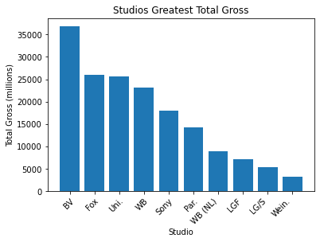
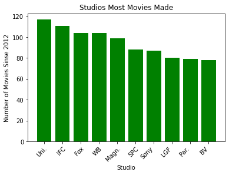
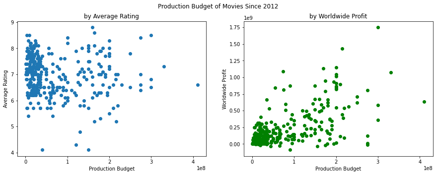
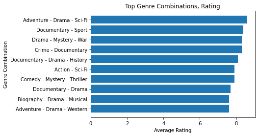
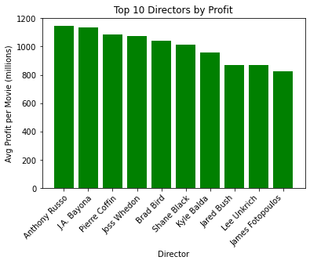

# Microsoft Movie Studio
**Authors:** Michael Licul, Justin James, Jake Cordrey

## Overview

This project analyzes the success of movies based on data gathered from multiple sources:
https://www.imdb.com/
https://www.the-numbers.com/
https://www.boxofficemojo.com/
We've come to the conclusion that genre type, the production budget, and the director play a most noticable role in profits. While it is important to get a good rating, we've found that it is not as important when trying to build capital.

## Business Problem

Microsoft is planning on expanding their company developing an original content studio. We believe it best to start with a comprehensive understanding of the current market. Doing so will allow for the best opportunity for success, longevity, and great content.

## Methods
    
We've created bar charts and scatter plots that have been a useful practice while coming to our conclusions. Doing so has allowed us to gain an understanding of trends and specific methods we can use to bring in profits. The information we are displaying is from 2012 to the present.
        
## Results

To find the studios that have been most succesful:
We found the studios with hightest total gross:

We also found the studios with the greatest number of movies made:

To find the most effective budget:  

To gauge if production budget correlated to a higher average rating (on the left): 

We then wanted to know if production budget correlated to a higher worldwide profit (on the right):

To find the most succesful genres and genre combinations:
We searched for the top gerne combinations by average rating:

We then decided to find which genre combinations brought in the most profit:

To gauge the success of the current directors:
We searched for directors who had more than one movie rated in the top 50 on imdb that also had atleast 100,000 votes:

    
We then wanted to find the directors who brought in the most profit based on all of the movies they had directed:

# Conclusion

## In order to ensure the highest probability of success, we advise to follow these key points:

## Hire staff from studios that have been the most successful
Buena Vista, Fox, Universal, Warner Bros., Sony, Paramount, LG/S

## Allocate the necessary budget proven to bring in profit
We recommend a production budget of $57,000,000. Of all movies that made a profit of at least $25,000,000, the average production budget was $57,000,000.

## Create movies in genres that are proven to draw crowds
Action, Adventure, Sci-Fi, Fantasy are the most monetary succesful genres to choose from

## Hire a director that has a large following and has consistently drawn profit
Anthony Russo, J.A. Bayona, Pierre Coffin, Joss Whedon, Brad Bird, Shane Black, Kyle Balda, Jared Bush, Lee Unkrich, James Fotopolus

Here is a link to our powerpoint presentation: https://docs.google.com/presentation/d/1mrdgza8fE5thFAxg4BWILcoGOg2y155Bsidb4iATji4/edit#slide=id.g190f093b999_0_283
