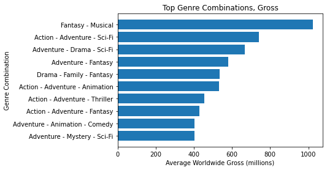

# Microsoft Movie Studio

## Overview

This project analyzes the success of movies based on data gathered from multiple sources:
https://www.imdb.com/
https://www.the-numbers.com/
https://www.boxofficemojo.com/
We've come to the conclusion that genre type, the production budget, and the director play a most noticable role in profits. While it is important to get a good rating, we've found that it is not as important when trying to build capital.

## Business Problem
    
Microsoft is planning on expanding their company developing an original content studio. We believe it best to start with a comprehensive understanding of the current market. Doing so will allow for the best opportunity for success, longevity, and great content.

## Methods
    
We've created bar charts and scatter plots that have been a useful practice while coming to our conclusions. Doing so has allowed us to gain an understanding of trends and specific methods we can use to bring in profits. The information we are displaying is from 2012 to
        
## Results

We wanted to gauge the success of the current directors:

We searched for directors who had more than one movie rated in the top 50 on imdb that also had atleast 100,000 votes:

    
Then we wanted to find the directors who brought in most profit based on all the movies they had directed since 2012:

We wanted to find the most succesful genres and genre combinations:

We searched for the top gerne combinations by average rating:

We then decided to find which genre combinations brought in the most profit:

We wanted to find the studios that have been most succesful:

We found the studios with hightest total gross since:

We also found the studios with the greatest number of movies made:

We wanted to find the most effective budget:

We wanted to know if production budget correlated to a higher average rating (on the left):
Then we wanted to know if production budget correlated to a higher worldwide profit (on the right):

  

Edited in GitHub

